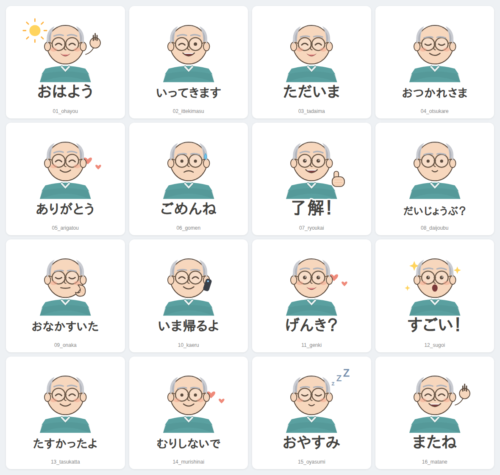

# 定年後のお父さん 一言LINEスタンプ 👨‍🦳

定年後のお父さんが、お母さん（奥さん）や娘さんに気軽に送れる、
**やさしい一言スタンプ**の全16種セットです。
毎日のちょっとした連絡に使える、あたたかい言葉をそろえました。



## 収録スタンプ（全16種）

| No. | 一言 | シーン |
|----|------|--------|
| 01 | おはよう ☀️ | 朝のあいさつ |
| 02 | いってきます | 出かけるとき |
| 03 | ただいま | 帰ってきたとき |
| 04 | おつかれさま | ねぎらいの言葉 |
| 05 | ありがとう ❤️ | 感謝 |
| 06 | ごめんね | あやまるとき |
| 07 | 了解！👍 | 返事・OK |
| 08 | だいじょうぶ？ | 気づかい |
| 09 | おなかすいた | ごはんの相談 |
| 10 | いま帰るよ 📞 | 帰宅の連絡 |
| 11 | げんき？ | 声かけ |
| 12 | すごい！✨ | ほめる・おどろき |
| 13 | たすかったよ | お礼 |
| 14 | むりしないで ❤️ | いたわり |
| 15 | おやすみ 😴 | 夜のあいさつ |
| 16 | またね 👋 | 別れのあいさつ |

## ファイル構成

```
LINEスタンプ/
├── svg/                 … スタンプの元データ（ベクター・編集可）
├── png/                 … 書き出し済みPNG（透過）
│   ├── 01〜16_*.png      … スタンプ本体（370×320px）
│   ├── main.png         … メイン画像（240×240px）
│   └── tab.png          … タブ画像（96×74px）
├── generate.py          … SVG生成スクリプト
├── render.mjs           … SVG→PNG書き出しスクリプト
└── contact_sheet.png    … 一覧プレビュー
```

## LINEスタンプ申請の規格について

このセットは [LINE Creators Market](https://creator.line.me/) の規格に合わせています。

- **スタンプ画像**: 370×320px 以下 / PNG / 背景透過 ✅
- **メイン画像**: 240×240px（`main.png`）✅
- **タブ画像**: 96×74px（`tab.png`）✅
- 個数は 8・16・24・32・40 個から選べます（本セットは **16個**）

### 申請の流れ（かんたん）
1. [LINE Creators Market](https://creator.line.me/) に登録
2. 「スタンプ」→「新規登録」
3. `png/` の中の画像をアップロード（本体16枚・メイン・タブ）
4. スタンプ名・説明・販売価格を入力して申請

## 作り直し・カスタマイズ

言葉や表情を変えたいときは `generate.py` の `STAMPS` を編集して、

```bash
python3 generate.py     # svg/ を作り直す
node render.mjs         # png/ に書き出す
```

シャツの色や髪の色などは `generate.py` 上部の「配色」で一括変更できます。
